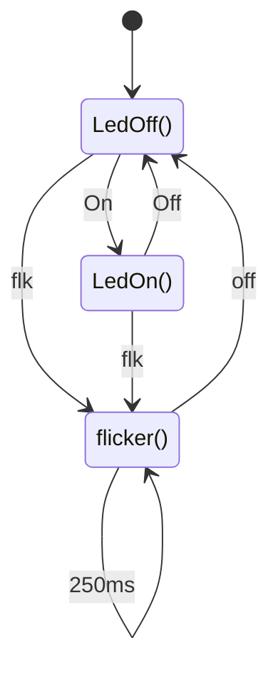

はじめに
----
Elixirには状態遷移処理`gen_state_machine` のライブラリーがありますが、その処理を使わないで作ってみました。
ここでは、その処理の説明を書きます。

状態遷移処理ってなんだ
-----

状態遷移処理(Googleより)
　　システムが持ちうる有限個の状態（ステート）の間を、**イベント（入力や条件）**に応じて**遷移（移り変わる）**させる仕組みや、その一連の処理のこと**

との説明ですが、見慣れない人にとっては、プログラムとなんの関係あるのか、と思うんでしょう。でも、ある意味、以下のIF-Then-Elseコードを状態遷移処理と言えるのではないでしょうか。
```
IF 条件 then
  処理A
else
  処理B
end
```
コードの処理A、処理Bが状態で、条件により状態が遷移していると言えると思います。ただ、処理A、 Bが状態と言えるほど継続していて、条件の代わりにイベントとなっているだけだと考えます。
状態遷移処理をFSM(Finite State Machine)と呼びますが、いつもなぜ「有限(finite)」が付いるんだと、面倒くせぇ、と文句を言っています。これは無限の状態遷移があり、それと区別するためとなっていますが、誰が作る時無限状態を考えるんとだ、ぶつぶつと。
でも、上記で示したIF-Then-Elseコードの各処理を状態と考えれば、書くプログラムは無限近い状態があると言えます。
その事から、状態遷移処理を考える時、「有限」は無視しても問題ないと思います。まぁ、元々、気になんてしていないでしょうが。

状態遷移を管理する処理(manager.ex)
----
状態を遷移させる処理です。とは言え、どの状態へ遷移するか、実際の状態処理中で決め、ここでは、単純に現在の状態の処理関数を呼ぶだけです。

1. start_link()を呼ぶ事により状態遷移処理を開始します。
2. start_link内で以下の関数をタスク起動します。
```
def dispatch(cb) do
  cb = apply(cb.mod, cb.func, [cb])
  dispatch(cb)
end
```
　　cbは%{モジュール名、状態関数、引数}との構成です。

3. 状態関数からの戻りは上記cbの構成のデータとなります。

各状態関数内で次にどの状態に遷移するか、判断し、cb内のfuncを更新します。
そして、この管理(dispach)に戻り、新たなfuncを呼び、遷移する事にしています。
イベントは関数内でイベント待ちをする事にしています。

タイマー管理(timer.ex)
----
ledのフリッカなどをさせる場合など、周期的(例250ms)にメッセージが飛んでくるようなタイマ処理です。
```
def countdown(tick, lists) do
  lists =
    receive do
       {eve, mod, timer, reply_eve} -> 
                  set_cb(lists, mod, eve, timer, reply_eve)
       _  -> lists
       
       after tick ->
          do_count(lists)
    end
    countdown(tick, lists)
  end
```
上記コードはTimer.start_link(tick)をした時に起動されるタスクです。
時間のカウントはreceiveのタイムアウトを利用し、メッセージにより、時間などを設定します。
設定メッセージ{eve,  mod, timer, reply_eve}は
   eve:  :oneshot、:cycle、:cancel
   mod: モジュール名
   timer: タイマー値/tick
   reply_eve: 返信してほしいイベント名

具体的状態関数の例
----

```
  def ledon(cb) do
    IO.puts("#{cb.func}  (#{timestamp(cb)})")
    ledon_loop(cb)
  end
  def ledon_loop(cb) do
    {eve, _msg} = FSM.rcv_msg()
    case eve do
      :off ->
        %{cb | func: :ledoff, arg: 0}
      :flk ->
        %{cb | func: :flicker, arg: 0}
      _ ->
        IO.puts("#{cb.func}  cont(#{timestamp(cb)})")
        ledon_loop(cb)
    end
  end
```
lenon()は遷移した時にする開始処理を書いています。一つの関数内に開始処理を含めたかったのですが、エンドレスループの処理ができないので、ワンクッション置く事にしたんです。
lenon_loop()はエンドレスルーブで、rcv_msg()によりメッセージ待ちをします。
受信したイベント(eve)により、遷移する処理を決定し、funcを更新します。

状態関数はタスクなので、どう作ろうか。自由ですが、以下の点が守る必要があります。
- どこかで待つ(受信処理など)処理を入れる。エンドレスが継続して動かないようにする
- 遷移する時、cbのfuncを更新し、cbを戻り値として戻します。構造は変えない。

作った状態遷移図(例)
---


[ソース](https://github.com/MickeyOoh/fsm_diagram)


テストコードと結果
----
```
def do_test() do
  FSM.start()
  Fsm1.start()
  do_loop()
end

def do_loop(statime) do
    Process.sleep(1000)
    FSM.notifyevent(Fsm1, :on, "hello")　## on 制御
    Process.sleep(3000)
    FSM.notifyevent(Fsm1, :off, "bye")　 ## off　制御
    Process.sleep(3000)
    FSM.notifyevent(Fsm1, :flk, "flicker on")　# フリッカー制御
    Process.sleep(3000)
    FSM.notifyevent(Fsm1, :flk_off, "bye")  # 停止
    do_loop(statime)
 end

```
結果:
```
iex(1)> Fsm1_Test.do_test
start_link %Fsm_manager{mod: Fsm1, func: :init, arg: 0, statime: 1765313682412}
ledoff  (0)
ledon  (1000)
ledoff  (4000)
flicker  (7000)
flk led off  (7250)
flk led on   (7500)
flk led off  (7750)
flk led on   (8000)
flk led off  (8250)
flk led on   (8500)
flk led off  (8750)
flk led on   (9000)
flk led off  (9250)
flk led on   (9500)
flk led off  (9750)
flk led on   (10000)
ledoff  (10010)
ledon  (11010)
```

まとめ
---
状態遷移処理を試しに作ってみたとの事で、実際に使用はできないと思います。
Elixirの関数型言語は、呼び出しの結果が同じ(純粋関数)が基本で、内部に判断は行なわないのが通常ですが、それを逸脱しています。

いずれにしても、こんなやり方もあるんだと紹介をしたかったので、書きました。


