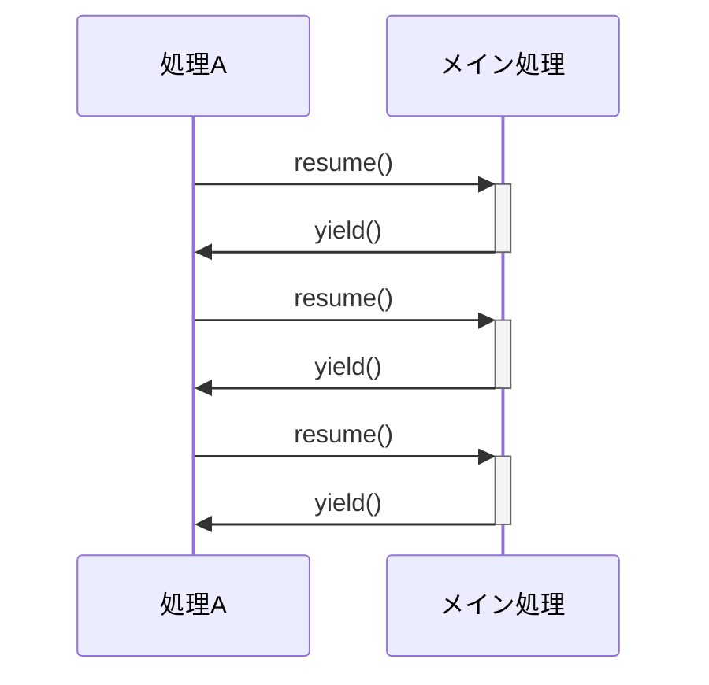

はじめに
----
ソフトを始めた頃、関数を呼び出したら、なんで戻らなくちゃはいけないんや、と思っていた。というのは、コルーチン処理をみて、制御処理が素直にかけるし、処理自体が呼び出し元に戻るかどうか決めるし、別に戻る必要もないじゃん、と思った。
ここでは、わけのわからない人からのわからない話となるが、「呼び出し戻る事から解放されたい」事について書きてみます。

コルーチンってなんだ
----
コルーチンとは(ネットから)
> 途中で止まって、また同じ場所から再開できる処理

これって、昔と説明が変わったなぁ、ルーチンの話は要らないのかなぁ、と思いました。
Co-Routineでお互いに呼び合って処理を進めていく方法。呼び合う事が肝だったはずなんですが、なんか変わりました。やりたい事、そのままなので分かり易く良いのですが、コルーチンと呼ばなくてはいけないのがつらい気がします。



処理 Aはresume()を呼ぶとメイン処理の処理が動く、そして、メイン処理はyield()を呼ぶ事により、処理 Aに戻る。戻ると言う事は処理 Aのresume()後の停止位置から再開する。
メイン処理で見ると、yield()で停止し、resume()によりメイン処理は停止位置から再開する事となります。
yield()によりその停止位置をメモリ、resume()を呼ばれたら、メモった停止位置から再開する仕組みで、停止位置をメモるのはメイン処理(コルーチンを起動した)のみ。

組込みでよく使うRTOSはこのコルーチンと同じ仕組みでyield()がOSコールwaitの意味で、OSからresume()の処理、起動(スケジューリング)する仕組みとなっています。OSはいろんな機能が用意されていますが、コルーチンは停止、再開に特化して速い処理です。

コルーチンで何ができるの
---
コルーチンを使うと、順序処理がそのまま書けて、分かり易く処理できる。
例として、あるシリアル送信の処理を簡単に書くと
```
1. データ送信要求を待つ(yield())           <---- resume(要求)
   データ送信開始
2. 送信割り込みとタイムアウトを待つ(yield()) <--- resume(送信割り込みorタイムアウト)
   1文字送信する。
3. 全てを送信するまで2.を繰り返す
4. すべて送信すると、完了した事を要求元に通知し、1.へ戻る
```
実は、コルーチンの機能だとは知らず知らずに使っています。
receiveの処理がそれに当たり、GenServerの機能にて`GenServer.call`内でreceive処理があり、メッセージ受信まで待っています(停止)。受信により再開します。receive()はyield()と同じです。
ただ、コルーチンは順番に処理する時、何度も使うって進めるのが特徴ですが、大概はreceiveのようにその時一回のみなので呼ばないんでしょう。でも、仕組みは同じです。

呼びだしで戻る事から解放されたい
---
コルーチンの処理があると、処理内で停止する、その関数から戻らない事になる。戻るかどうかはその関数の処理次第となります。
関数は入力により戻ってくる事が前提なのですが、コルーチンの処理だと、戻る必要がない。

開発してきたソフトはこのコルーチンを使用し、関数内で無限ルーブさせるものが多い。
通信の処理例、while(1)をよく使うのでをForeverとマクロ定義する事にしています。
```
Forever{
	データリンク確立する    #処理の中にはコルーチンばかり
	Forever{
		データ受信、データ送信要求、または、エラー発生を待ちます
		
		データ受信の場合、受信処理。送信の場合、データを送信する
		エラーの場合、内容によりbreakさせ、外ループの再度データリンク確立させる。
	}
}
```
各処理の中にはコルーチン処理(待ち処理)がたくさんに入ってる。

そもそも「戻りたくない」話のきっかけは、コード上の問題からで、
親関数から子関数に呼ぶが、他子関数に遷移する時、一旦親関数に戻る必要がある。そんなの面倒じゃ、その親なんにもしてないくせに、といつも思っていた、事が最初。

自作の状態遷移処理
```
def dispatch(cb) do
  cb = apply(cb.mod, cb.func, [cb])
  dispatch(cb)
end
```
の処理で各状態遷移処理関数(cb.func)を切り替えるのに各子関数内でcb.funcを変更する事によりやっています。いつも状態遷移する時、上記親処理(dispatch())に戻る必要がある。

ちなみに関数型プログラミングでこの事を解決してくれるものかも、と思って始めました。

コルーチンに話を戻して、ChapGptに助言も求めると(自分の言葉にしたいのであまり採用したくなかったが、許して下さいませ)

私の問い
```
今、「関数から解放されたい」との題で、記事を書こうしているんです。 
「呼び出しで戻る事から解放されたい」 それで、コルーチンの説明から、RTOSも同じ動きだと説明する。 そして、関数の動作の究極は関数型プログラミング、そろそろ、コルーチンのように処理できるようにした方が良いのでは、との主旨です。 これについて、何か参考意見はありますか。
```
回答の抜粋
```
- 関数は「**完結する処理**」しか表現できない  
- 現実の処理は「**継続中の存在**」が多い
    
最後に、こういう問いを置くといいです：
> - なぜ私たちは、  
>     「処理は return で終わるもの」だと  
>     無意識に思い込んでいるのか
>     
> - RTOSでは当たり前に  
>     「途中で止まり、再開する」ことを  
>     何十年も前からやっているのに
>  
👉 **「関数は本当に最小単位なのか？」**
```

まとめ
----
まとめは、前章の最後にあります。(ChapGptなのでここにコピーするのは忍びない、すみません)

入力し戻るという関数の仕組みの究極の「関数型プログラミング」に行き着いたんだから、そろそろ、数学的な理想から現実に合わしてもいいのでは、と思う。


