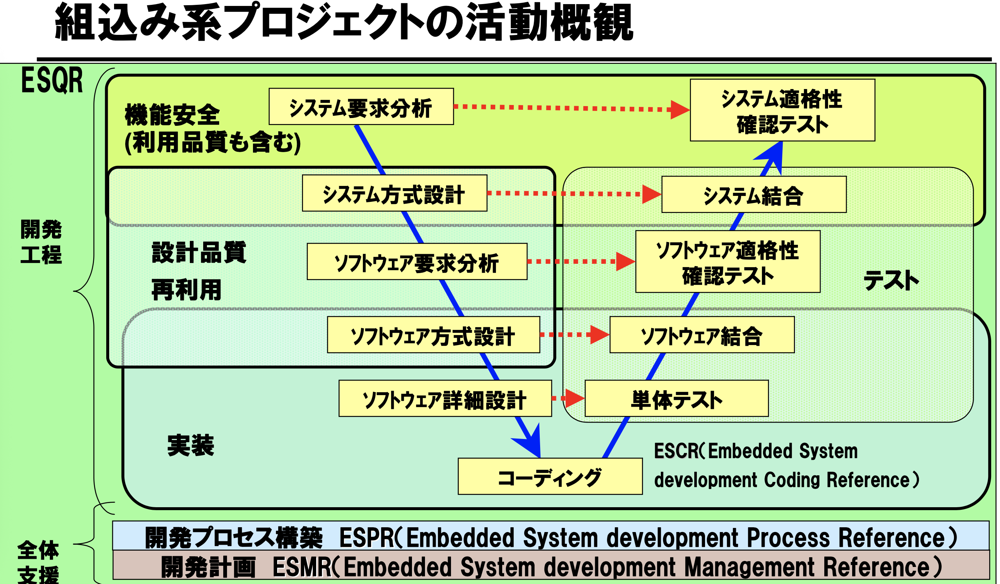

はじめに
----
RTOS上での組込みソフトを開発してきたが、周りを見渡すと組込みLinuxを利用するシステムが多くなった気がする。そんな中、Elixir/Nerves、組込みプラットフォームを使い始め、なんか違うと思い、どうしたら自分の思ったとおりに作れるんだろうか、と模索続けている。この不満・疑問から、なんでRTOSが必要なんだろうかと、その理由を支離滅裂にここに書いてみます。

ワンマン社長と担当割りとの違い
----
組込って、なんか会社組織を作っているようだ、といつも思う。仕事を開発部、設計部、製造部などと機能を分割していく、一方、Linuxのような非RTOSではなんでもひとりこなすような気がする。おそらく、機能の捉え方が大小と違っているんだろう。
なんとか、例を出してみる説明すると、今、「スイッチにより照明を点灯/消灯する」システムを考えてみると
　ワンマン社長の場合　照明の制御機能と大まかな機能把握
　　処理: スイッチ情報を読み込み、その状態により、照明制御するとひとつappが行う
　組込みの場合　スイッチ入力処理、判断処理、出力処理と詳細に分割していく
	　入力処理:  状態を監視し、変化があればその状態を判断処理に通知
	　判断処理:  通知を受けた情報により照明を点灯/消灯の判定、結果を出力処理
	　出力処理:  出力する
	　
組込み開発では通常、要求分析、基本設計、詳細設計、実装など、以下の開発プロセスに乗っ取って進められる。

システムは複雑な機能が多いので、トップダウンで上流部分からシステムを見渡さないと問題が把握できない。そのため、このプロセスは必要で、どんどん機能が詳細に分割される事となる。
この開発プロセスがあるから機能が詳細になるんだとは違うかも。元々、組込は機能を突き詰めるものなので、細かに分割されるのが必然の結果。そして、機能全体を通して早期問題発見するため開発プロセスが重要視される。

まぁ、規模次第で簡単なシステムではこんな事やってられるか、としてはいない。

コミュニケーションが大事
----
組織が大きくなると部署分割する、部署が多くなるとその部署間で意思疎通(コミュケーション)が必要となる。組込において、機能が分割すればするほど、機能間での通信が必要となる。
こうして下さいね、と要求する事もあるし、あれってどうなっているのと問い合わせする事もある(通信)。イチ、ニー、サンと息を合わす必要もあるし、共用の例えばプリンターなどで、使っているからちょっと待ってよと言うことも必要(同期、排他)。

このコミュニケーションツールとして、RTOSが欠かせないんだよなぁ。

RTOSは何をしてくれるの
-----
WindowsOSが出てきた時、これでなんでもできるようになるんだ、皆んなが思ったが、結局アプリがなく何もできなかった。もうそんな事を思う人なんていないとは思うが、RTOSがあるから組込が作れるわけでは当然ない。OSはアプリを円滑に動かしてくれるツールでしかない。あくまで作り易くなるだけの事。

RTOSには以下のような主な機能がある。
* タスク管理、割込み管理
	　タスクのスケジューリング、割込による優先処理など
	　タスクの動く順番が制御し易いものになっている。注意が必要な事はひとつタスクが動き続けると他の処理は動かない。処理をどう動かし制御するのかが目的なので、タスクが勝手気ままに動かすわけにはいかない。
* メッセージ通信
　　　タスクとメッセージパスは独立していて、タスクはどのパスか決め受信する事となる。送る時はタスクに対して送るのではなく、バスに対して送る。この事により、通信の自由度が増える。例えば、mailboxを緊急通知用、普通用などと目的のメッセージのみを受信する事ができる。
* イベントフラグ通信
	　メッセージ通信と同じで独立している。メッセージは情報だが、通知の意味となる。メッセージを3回送信した時、相手は3回受け取る事になるが、イベントは3回通知しても、相手が受け取る時には1回となる。例、周期的にタスクを動かす事が多いが、その時間通知をイベントで通知する。
* 排他、同期制御(セマフォ、ミューテックス)
	　例えば、ひとつのファィルを複数のタスクが読み書きする場合、排他制御をしないとデータの整合性がとれない。A読み->A処理->A書きで複数タスクが処理すれば、 A読み->A処理-> B読み->B処理->A書き->B書きの可能性があり、A書きのデータが無視されるので排他制御、つまり  A処理中はB処理をしないようにする。

詳細な機能を説明してもどう使うか、わからないだろうし、ソフト構成から説明しないといけないので止めます。

要は、
- 処理がどのタイミングでどう動かせるか、制御しやすい
- いろんな通信が準備されていて、またもや、制御しやすい。
となるのかなぁ。

RTOSのリアルタイムって、処理が速いとの事ではない
----
リアルタイムって、なんか処理が速いんだとの思われがちだが、処理時間が把握できるとの意味で、ある処理から次の処理が動くまでの「時間が予測できる」との事。
最近のハードは、ある時間まで処理しなければならないような時間の制約がなく余裕があるし、CPUが高速になり処理時間を気にする必要がなくなった。つまり、時間、時間と叫ぶが、そんなもの、気にする必要がなくなったではないだろうか。
このリアルタイムという言葉は「処理のタイミングが取れるもの」と感覚が正しい気がする。

まとめ
----
組込みではいろんな機能が集まって構成される事が多く、その機能間のインターフェイスにRTOSが使用される事になる。
RTOSを使わずに組込みを作る事はできるが、複雑になり、正確には動作しないのではないだろうか。その複雑な部分、機能を分割する事により明確にし、動作を保証するのではないでしょうか。

